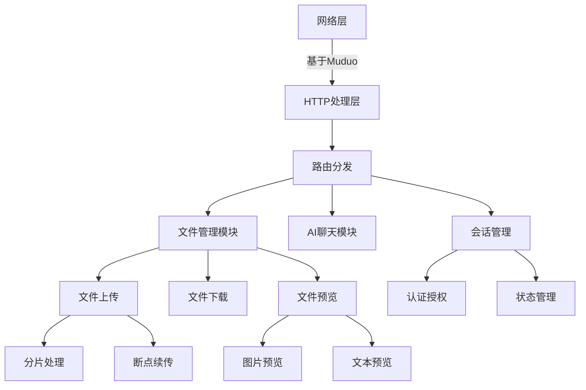

<<<<<<< HEAD
# PriveteServer：基于Muduo的高性能HTTP服务框架

## 项目介绍

PrivateServer 是一个基于C++ Muduo网络库实现的高性能HTTP服务框架。该项目在原框架基础上进行了功能扩展，新增了文件管理系统和AI聊天功能，使其成为一个功能更全面的Web服务平台。

### 核心功能亮点

#### 文件管理系统
1. **文件分片上传与断点续传**
   - 支持大文件分片上传，避免内存溢出
   - 自动重试机制确保上传可靠性
   - 断点续传功能，上传中断后可继续上传
   - 格式统一，文本文件自动转为UTF-8编码
   
2. **文件预览与下载**
   - 支持文本、图片等多种格式预览
   - 高效文件下载，支持大文件流式传输

3. **文件管理**
   - 创建文件夹及多级目录管理
   - 文件删除操作

#### AI聊天系统
1. **多模型聊天功能**
   - 支持千帆模型和GPT-3.5-turbo模型

#### 基础HTTP服务
1. **高性能网络处理**
   - 基于Muduo网络库的Reactor模式
   - 支持多线程并发处理
   - 高效事件驱动模型

3. **RESTful API**
   - 动态路由支持
   - 中间件处理链
   - JSON请求/响应处理

## 项目环境

### 环境依赖
- **操作系统**：Ubuntu 22.04+
- **数据库**：MySQL 5.7+
- **核心库**：
  - Muduo网络库
  - Boost 1.69+
  - OpenSSL
  - nlohmann/json
  - libmysqlcppconn
  - uchardet

## 编译与运行

### 编译步骤
```sh
# 创建构建目录
mkdir build
cd build

# 生成Makefile
cmake ..

# 编译项目
make

# 清理构建
make clean
```

### 运行服务
```sh
# 默认端口运行(80端口需要sudo权限)
sudo ./simple_server

# 指定端口运行
sudo ./simple_server -p 8080
```

## 系统架构

### 核心模块设计


## 功能展示

1. **登录界面**  
   

2. **注册界面**  
   

3. **菜单界面**  
   

4. **ai界面**  
    

5. **文件中心界面**  
    

6. **五子棋界面**  
    
=======
